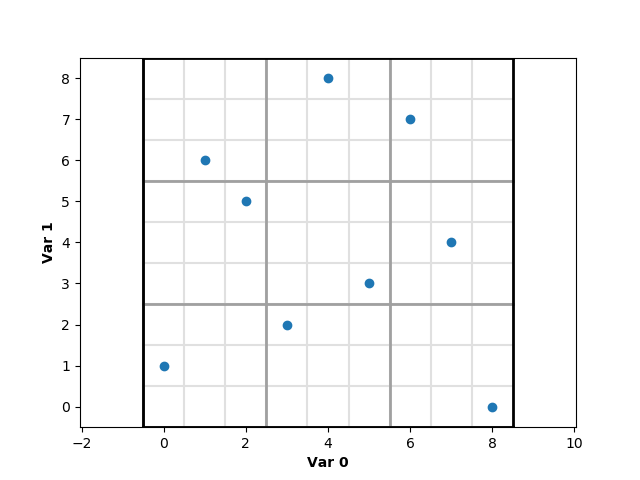

## sudoku_lhs

Latin hypercube sampler with a sudoku-like constraint


### Introduction

The sudoku LHS algorithm is a bit like the first stage in the design of an `N`-dimensional sudoku puzzle, hence the name: each "sudoku box" must have exactly the same number of samples, and no two samples may occur on the same axis-aligned hyperplane.

Sudoku LHS runs in linear time (w.r.t. the number of samples), and requires a linear amount of memory. Details are provided in the [source code comments](sudoku_lhs/sudoku.py).

Sudoku LHS  is inspired by, but not related to, orthogonal sampling. The latter refers to LHS sampling using orthogonal arrays; about that, see the articles:
  - B. Tang 1993:    Orthogonal Array-Based Latin Hypercubes,
  - A. B. Owen 1992: Orthogonal arrays for computer experiments, integration and visualization,
  - K. Q. Ye 1998:   Orthogonal column Latin hypercubes and their application in computer experiments

Latin hypercube sampling itself was first described in
  - M. D. McKay, R. J. Beckman, W. J. Conover, 1979. A Comparison of Three Methods for Selecting Values of Input Variables in the Analysis of Output from a Computer Code

For a quick description of classical LHS, see e.g. [Wikipedia](http://en.wikipedia.org/wiki/Latin_hypercube_sampling).

### Comparison to other methods

#### Stratification

Sudoku LHS improves on pure Monte Carlo and classical LHS, but loses to [IHS](http://people.sc.fsu.edu/~jburkardt/cpp_src/ihs/ihs.html), on which the original paper is:
  - Beachkofski, B. K. and Grandhi, R. V., 2002. Improved distributed hypercube sampling. In 43rd AIAA structures, structural dynamics, and materials conference. AIAA-2002-1274. Denver, CO.

IHS is (close to?) ideal in this regard, as it specifically aims to maximize the distance between pairs of sampled points.

#### Statistical independence of sample components

In the sense of the pairwise linear correlation coefficient of columns (which contain the permutations), sudoku LHS typically improves statistical independence when compared to pure Monte Carlo or classical LHS. The improvement is the most marked in two dimensions (because sudoku LHS stratifies in 1 and `N` dimensions, and here `N` = 2), but some improvement is also noticeable for at least `N` = 3 and `N` = 4 (where stratification occurs only in 1 and 3 (resp. 1 and 4) dimensions). See [test/sudoku_cor_test.py](test/sudoku_cor_test.py) to produce actual numbers.

Orthogonal sampling, by definition, produces the ideal sample in this regard (exactly zero correlation).


### Example

```python
import sudoku_lhs
# input: dimensions, sudoku boxes per axis, number of samples to place in each sudoku box
# output: sample array, number of bins per axis
S,m = sudoku_lhs.sudoku.sample(2, 3, 1, visualize=True, verbose=True)
```

Trivial combinatorial and classical LHS samplers are also provided for comparison:

```python
S2 = sudoku_lhs.lhs.sample(2, m)  # same number of bins as above
S3 = sudoku_lhs.comb.sample(2, m)
```

Note that combinatorial sampling is very expensive (generates a very large number of samples), which is why LHS methods have been developed.


## Installation

### From PyPI

Install as user:

```bash
pip install sudoku-lhs --user
```

Install as admin:

```bash
sudo pip install sudoku-lhs
```

### From GitHub

As user:

```bash
git clone https://github.com/Technologicat/sudoku_lhs.git
cd sudoku_lhs
python setup.py install --user
```

As admin, change the last command to

```bash
sudo python setup.py install
```


### Historical note

The variant of sudoku sampling implemented here was originally developed as part of the SAVU project in 2010, and briefly mentioned in the author's paper
  - Jeronen, J. SAVU: A Statistical Approach for Uncertain Data in Dynamics of Axially Moving Materials. In: A. Cangiani, R. Davidchack, E. Georgoulis, A. Gorban, J. Levesley, M. Tretyakov (eds.) Numerical Mathematics and Advanced Applications 2011: Proceedings of ENUMATH 2011, the 9th European Conference on Numerical Mathematics and Advanced Applications, Leicester, September 2011, 831-839, Springer, 2013.

Later, Shields and Zhang independently developed and published a variant of sudoku sampling, published in
  - Michael D. Shields and Jiaxin Zhang. The generalization of Latin hypercube sampling. Reliability Engineering & System Safety 148:96-108, 2016. [doi:10.1016/j.ress.2015.12.002](http://doi.org/10.1016/j.ress.2015.12.002)

### License

[BSD](LICENSE.md). Copyright 2010-2017 Juha Jeronen and University of Jyväskylä.

